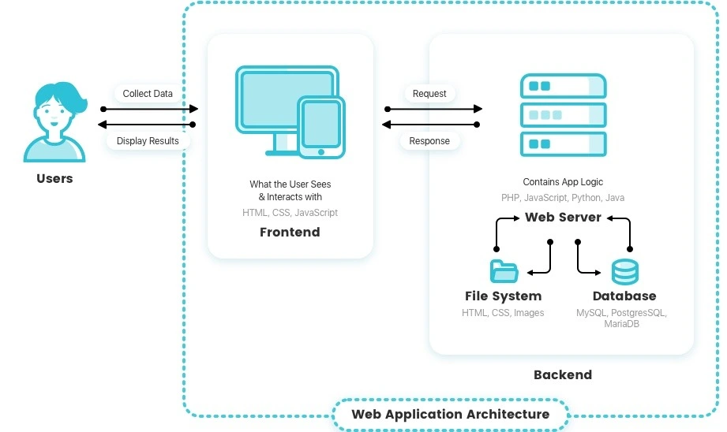

 Getting Started with Burp Suite

 
Hackeriot Conference 2025.
 
Tel Aviv, Israel.
 
https://www.hackeriot.org/

# 1. About me

#### Whoami
Raya Klein, penetration tester, Shorsec.

My linkedin: https://il.linkedin.com/in/raya-klein

#### My journey
I actually started my journey in academia, studying and then lecturing in cybersecurity and programming. But I wanted to go for what I was really passionate about - cybersecurity, so I made the shift to the “real world” becoming a penetration tester.

# 2. What is Burp Suite?

* It's not just a tool. it's your personal web security lab.
* It's a magnifying glass for all internet traffic.
* It's the Swiss Army knife for every web application hacker.
* Simply put: It gives you full control over the communication between your browser and the internet.

# 3. Installations

#### 1. Burp Suite community

https://portswigger.net/burp/releases/professional-community-2025-7-4?requestededition=community&requestedplatform=

#### 2. Juice Shop - OWASP

https://github.com/juice-shop/juice-shop

* Requirements: 
    * Node.js installed. https://nodejs.org/en/download
    * git (optional)

# 4. Setting a proxy

We need to have a proxy for the burp to actually get the requests before the get sent to the website.

#### Option 1: FoxyProxy extention

If we want to use the regular browser - we will need 2 things:
1. setting up a proxy to transfer all the traffic to Burp. 
2. setting the burp certificate in the browser. 

#### 1. FoxyProxy

* Install the extention: https://chromewebstore.google.com/detail/foxyproxy/gcknhkkoolaabfmlnjonogaaifnjlfnp?hl=en

* Set up the proxy: options -> proxies -> add 

* In burp - make sure the proxy also set on 127.0.0.1:8080

* Add the burp certificate to chrome: open chrome and go to: `127.0.0.1:8080` address. Download the CA certificate. 

* In chrome - go to settings -> Privacy and security -> Security -> Manage certificates -> Trusted Root Certification Authorities
Then Import the downloaded certificate. 
    > note: On the "Certificate Store" screen, make sure "Place all certificates in the following store" is selected and the store shown is "Trusted Root Certification Authorities". If not, browse and select it. Click "Next".

#### Option 2: BurpSuite browser

It is the built-in browser of Burp Suite. No need to add a proxy or certificate. 

# 5. Burp Suite Proxy 

* Open the BurpSuite browser / via regular browser with proxy
* Go to: `localhost:3000` - our JuiceShop will appear. 
* In Burp, Go to `Proxy -> HTTP history`
* click on areas in out shop and see the traffic in burp. 

# 6. How a Website Works 
* UI (The Storefront): What you see and click on in your browser.
* Server (The Brains): The computer that processes your requests and does the work.
* Database (The Vault): Where all the valuable data like usernames and passwords are stored.

Our Goal as Hackers: Bypass the pretty storefront (UI) to gain control of the brains (Server) and unlock the vault (Database).

# 7. HTTP Request Types

* **GET** - To See/Read 
Used for viewing a webpage or looking at data.
Example: Loading your profile page.

* **POST** - To Create 
Used for sending new information to a website.
Example: Making a new post or registering for an account.

* **PUT** - To Update/Replace 
Used for editing information that already exists.
Example: Changing your profile picture.

* **DELETE** - To Remove 
Used for deleting information.
Example: Deleting a comment.

# 8. Your Hacker's Hit List: Where to Look First
* **Outdated Software:** Hunt for old components with known vulnerabilities. 

* **Malicious Inputs:** Test every input box for injection flaws (SQLi, XSS). 

* **Broken Access Control:** Rattle the locked doors to see unauthorized data. 

* **Hidden Content:** Search for secret files and folders developers left behind. 

specifically in our JuiceShop - these are the current vulnerabilities: 

# 9. Lets start hacking! 
### Directory enumeration / Meet Burp Suite Intruder

* Our first challenge will be to directory enumerate the website. there are multiple tools and ways to do it(such as ffuf and dirsearch), we will use Intruder. 

**Intruder** - allows us to send multiple requests at once. Great for directory enumeration, username enumeration, and brute force. 

> Your task: Create a list of 300 paths that can be relevant for our website(can be using AI), and run it on the website to see what we can find. 

>  Advanced task: Create a list of simple / easy passwords and try to guess the admin password using intruder. The email is: admin@juice-sh.op. 
Note: There are multiple ways to access the admin account. One of them is SQL injection in the login form. 

# 10. Authorization Bypass 
### 1. View someone else's basket with Burp Repeater

> Authorization bypass via GET request. 

The goal here is to catch the request that is responsible to show the user's basket. 

We transfer the request from Burp Proxy to Repeater(ctrl+r or right click), then we can edit it manually and click `send`. 

> The solution: we can modify the busket's number to access someone else's busket. 

### 2. Customer Feedback - write a feedback for another user. 

> Authorization bypass via POST request. 

We will write a regular feedback in the website, and will catch the request in Burp. 

In Burp Repeater - we will modify the userID to other number - and see how response is successfully CREATED. 

http://localhost:3000/api/Feedbacks/

## Extra

##### JWT hashed password
Install the 'JSON web token' extention from the BApp store inside the Burp Suite program. 

View the JWT in the Burp Repeater, in any request after logging-in. We can see the hashed password in the payload, and can crack it easily offline. 

## Useful Links

* PortSwigger Academy and labs - https://portswigger.net/web-security/all-labs
* OWASP top10 - https://owasp.org/www-project-top-ten/

## Hackeriot Feedback

Its important to us that you will fill your feedback about this workshop. Thank You! and see you next year!

